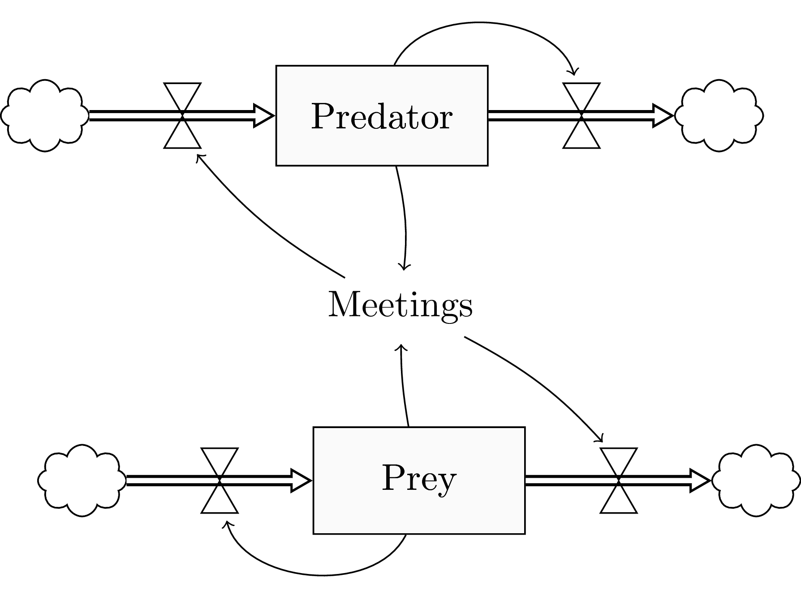

# Latex package for System Dynamics 

This aims at supporting latex users with some tikz experience to draw system dynamics (SD) diagrams
in his/her latex documents.

## Usage
1 Add the following line to your preamble:
````latex
\usepackage{systemdynamics}
````
1 Compile using pdflatex
Make sure the systemdynamics.sty file is somewhere where your latex distribution will find it.

## Example Diagram
The following code draws a simple two-state diagram.

````latex
\documentclass{standalone}
\pagestyle{empty}
\usepackage{systemdynamics}

\begin{document}
\begin{tikzpicture} 

% Predator population
\node (predator) [stock] {Predator};
\flowIn{predator}{}
\flowOut{predator}{}
\sdarrow{predator}{out_predator_up}{bend left=70}

% Prey population
\node (prey) [stock, below=7em of predator, xshift=1em] {Prey};
\flowIn{prey}{}
\flowOut{prey}{}
\sdarrow{prey}{in_prey_down_nolabel}{bend left=70}

%Meetings
\node (meetings) [sdvariable, below=3em of predator, xshift=0.5em]  {Meetings};
\sdarrow{prey}{meetings}{bend left=5}
\sdarrow{predator}{meetings}{bend left=10}
\sdarrow{meetings}{in_predator_down_nolabel}{bend left=10}
\sdarrow{meetings}{out_prey_up}{bend left=10}

\end{tikzpicture}
\end{document}
````

The output will look as follows:


